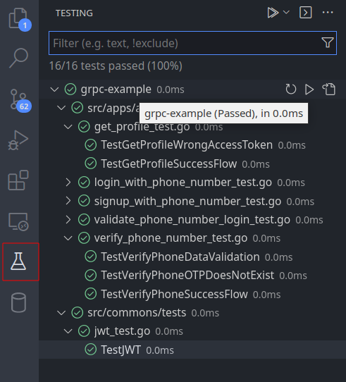
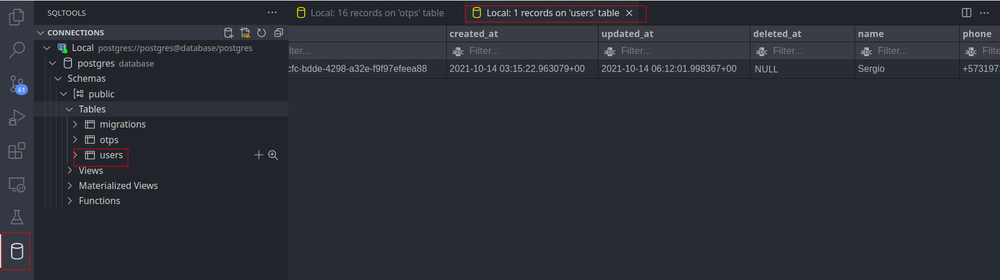

# GO Grpc Advanced Example

This repo it's an advanced example of Golang microservice with GRPC, with the following capabilities:

- AuthService for handling signup, login, and get profile of the user
- OTPService for sending SMS via Twilio API
- JWT authentication
- GCP Pub/Sub for communicating AuthService and OTPService
- Database migrations using goose and postgresql
- Unit and e2e tests
- Using doppler for secret management
- Advanced Vscode configuration with Remote Containers for having a fastest configuration

## Getting Started

- Install Docker
- Install Vscode
- Install Vscode [Remote Containers](https://code.visualstudio.com/docs/remote/containers-tutorial)
- Create the file `.devcontainer/.env`
- Clone and open the project with Remote Containers (see section below)
- Pass to the end to end section!

## End to End tests

- On the terminal write the following messages
- `start` for initializing the Auth Service
- Optional `subscriber` for initializing the OTP Service
- `1_SignupWithPhoneNumber Sergio +57012345789`
- `2_VerifyPhoneNumber 4843 +57012345789`
- `3_LoginFirstStep +57012345789`
- `4_LoginSecondStep 9291 +57012345789`
- `5_GetProfile`

## Unit tests

- Every service package has aside a test folder
- The unit test are mocking external calls to database or API via mocking interfaces




## Folder structure

```
.
|-- README.md
|-- docs
|   `-- For adding more documentation
|-- e2e
|   `-- Scripts for making e2e tests (right now manually because OTP validation)
|-- go.mod
|-- go.sum
|-- migrations
|   `-- Migrations using goose with SQL
|-- proto
|   `-- Proto files for defining microservices contracts
|-- scripts
|   `-- Bash scripts for common tasks
`-- src
    |-- apps
    |   `-- {{service}}
    |       |-- main
    |       |   `-- The main programn for executing the app
    |       |-- services
    |       |   `-- The implementation of the proto service
    |       `-- tests
    |           |-- mocks
    |           |   `-- Mocks of the interface of external elements i.e. database, third party apis, etc
    |           `-- Tests of the services
    |-- commons
    |   |-- services
    |   |   |-- pubsub
    |   |   |    `-- Service for pub sub
    |   |   `-- jwt
    |   |       `-- Service for create JWT tokens
    |   |-- tests
    |   |   `-- Test of the services
    |   `-- utils
    |-- data
    |   |-- models
    |   |   `-- Models used by the apps
    |   `-- repositories
    |       `-- Layer for accesing to the database and the models
    `-- proto
        `-- Auto generated folder
```


## Why using Remote Containers

### Bash

- The bash automatically imports the secrets from doppler
- It keeps the user's historial
- It has installed tools for development look `.devcontainer/Dockerfile:local`
- You can run scripts present in `scripts/` and `e2e/`

### Database

- It adds a local database
- It automatically installs a plugin for using the database with the connection ready



## Database Migrations

1. Create a new migration `makemigration xxxx`
2. For migrating use `migrate`
3. For reset the database use `migrate-reset`


